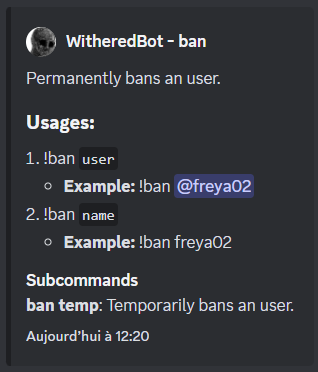

# V3 Overview

While V3 has most major features reworked and improved, this came to a cost; 
in particular, some parts of the API are now built toward Kotlin users. 
It is not sure how the API may be adapted to fit Java users more.

While some features which require configuration using a DSL appeal more to Kotlin users, 
they should still be usable by Java users.

Fortunately, annotation-driven features that already existed can still be used with no problem, both in Java and Kotlin.

You can also refer to the [examples](examples) 
and bot templates ([Java](https://github.com/freya022/BotCommands-Template-Java/tree/3.X) / [Kotlin](https://github.com/freya022/BotCommands-Template-Kotlin/tree/3.X)) 
to have an idea on how V3 is supposed to be used.

## Base package change
To better align with the Maven coordinates, the base package has changed from `com.freya02` to `io.github.freya022`.

Fixing this should be as simple as using Find & Replace.

## Kotlin support
All commands and handlers support coroutines (except service factories) and default parameters.

Each feature has its own `CoroutineScope`, configurable in `BCoroutineScopesConfigBuilder` 

## New dependency injection
In V2, you had to register your resolvers, instances, instance suppliers... using `ExtensionsBuilder`, which enabled you to use constructor and field injection.

In V3, you no longer need to manually manage your instances manually, a basic DI framework can manage all your services, commands, handlers, resolvers... as long as you annotated them with their appropriate annotations.<br>
You then simply put a parameter in your constructor/method to receive the requested service type.

`@BService`, `@Command` and `@Resolver` are the annotations you will need the most.

### Services and factories
`@BService` can be used to declare classes as services, or, when used on a method, serves as a factory for the return type.<br>
As always, if they are on your search path, then they will be instantiated when building the framework, 
and available to other classes.

These services can all have a name, in case you want multiple services of the same type, but want to differentiate them.

#### Primary providers
When requesting a service, only one service must correspond to the given type/name.

If multiple service providers exist, only one must be usable, or, only one must be marked primary (using `@Primary`).

**Note:** Service factories are prioritized over annotated classes.

**Kotlin note:** Service factories can be top-level functions.

### Conditional services
#### Interfaced conditions
`@ConditionalService` can be used when you want your service/command/resolver... to be created under certain conditions.<br>
The annotation will only let the service be created if all the specified check interfaces passes.

#### Annotation conditions
`@Condition` is a meta-annotation that can be used on an annotation you create, 
which enables this annotation to represent a custom condition for service creation.

You can also specify if failure of these annotations throws an exception.

An example can be found [here](examples/src/main/kotlin/io/github/freya022/wiki/switches/WikiLanguage.kt).

### Interfaced services
You can find the `@InterfacedService` annotations on some interfaces of the framework, such as `SettingsProvider` or `IHelpCommand`.<br>
This annotation indicates that this interface can be implemented, but needs to be registered as a service.<br>
This is useful for when the framework needs an instance of the interface, without knowing what the implementation is.<br>
For example, if you want to override the help command, you will need to make an implementation for `IHelpCommand`.

Most interfaces that were configurable in `CommandsBuilder` were replaced by interfaced services,
such as command/component filters, `SettingsProvider`, `ExceptionHandler`, `AutocompleteTransformer`, etc...

An example can be found [here](examples/src/main/kotlin/io/github/freya022/bot/commands/text/HelpCommand.kt).

### Dynamic suppliers
Dynamic suppliers are interfaced services (that you can make multiple instances of), 
which lets you provide services of any type.<br>
The framework will give you the class of what it wants to instantiate, 
and you can then tell if your supplier supports the class, or not, 
or if it is supported but cannot create an instance of it.

An example can be found [here](examples/src/main/kotlin/io/github/freya022/bot/commands/ban/BanService.kt).

## New command declarations
Commands can now be declared using a DSL, these works best if you use Kotlin.

### Declaration DSL
To use the DSL, you can check out `@AppDeclaration` and `@TextDeclaration`.

The DSL can help you provide each parameter explicitly, without the need for annotations,
and also enables more features, such as [option aggregates](#option-aggregates).

The DSL also enables you to declare commands with code, configure your names, descriptions, choices... everything by code, 
so you are not limited to static values with annotations.

You can find an example [here](examples/src/main/kotlin/io/github/freya022/bot/commands/slash/SlashBan.kt),
see `SlashBanDetailedFront#onDeclare`.

## New option aggregates
Option aggregates are a way to combine multiple options into one object, 
the function that combines all the options can be anything, including a constructor.

### Option aggregates
Normal aggregates can accept any option type (Discord option, custom option or generated option).

You can still insert options without declaring an aggregate; these options will implicitly have an aggregate created for you.

**Note:** Option aggregates are only available with DSL declaration (and components and modal handlers by using `@Aggregate`).

You can find an example [here](examples/src/main/kotlin/io/github/freya022/bot/commands/slash/SlashBan.kt),
see `aggregate` in `SlashBanDetailedFront#onDeclare`.

### Vararg options
Vararg options are a special type of option aggregate, they are essentially an aggregate that generates N options, 
and the aggregator just accepts a `List` and returns it as-is, i.e. your parameter accepts a `List`, not a real vararg.

You can use these with `optionVararg`.

**Note**: Aggregators can accept `List` parameters, but all the options must be under the same *declared* parameter name, so they can be all put in the list.

You can find an example [here](examples/src/main/kotlin/io/github/freya022/bot/commands/slash/SlashChoose.kt).

### Inline class options
Kotlin's inline classes can also be used as options, 
you can use `inlineClassOption` to declare one in the DSL, they also automatically work for annotated commands.

`inlineClassOptionVararg` can also be used for inline classes that accept a varargs.

You can find an example [here](examples/src/main/kotlin/io/github/freya022/bot/commands/slash/SlashSentence.kt),
with `SlashSentence.SentenceParts`.

## New rate limiting
A [token bucket](https://en.wikipedia.org/wiki/Token_bucket)-based rate limiting has been added, 
while `@Cooldown` still exists, `@RateLimit` now lets you define buckets, with multiple bandwidths, 
letting you create custom rate limiting for each of your command/component handler.

A common example is a spike protected bucket, which, in addition to the normal rate limit,
helps you prevent users from spamming a command in a short period of time, 
forcing them to spread out your resource usage.

Rate limits can be used with:
- `@RateLimit` (for annotated commands)
- `#rateLimitReference` (for DSL commands and components) 
- A declarator function, annotated with `@RateLimitDeclaration`, using `RateLimitContainer#rateLimit`,
  using them is as simple as using `@RateLimitReference` for annotated commands,
  or `#rateLimitReference` for DSL commands and components.

A bucket token can be added back by using your event's `#cancelRateLimit()`, 
which effectively cancels the rate limit applied before entering any handler.

## Improved filters

In addition to being implemented as services, filters can now be used on specific commands / components.

These filters can be declared as global filters, but must override the `global` property with `false`, 
you can then reference those filters in:
- `@Filter`: Requires all filters to pass, can only be used on commands
- The `filters` property of command DSLs, you can even combine filters using `and` and `or`, 
such as `filters += (filter<IsBotOwner>() or filter<IsGuildOwner>()) and filter<InVoiceChannel>()`

Component filters must be passed while building the components, and have the same usage as for command DSLs.
Java users can also use the `addFilter` methods.

## Autocomplete changes
Autocomplete annotations and event have been renamed using `Autocomplete` instead of `Autocompletion`.

Other than that, `@CompositeKey` has been replaced by `compositeKeys` on `@CacheAutocomplete`. 
This lets you configure what Discord options (you can also put the parameter name) must be in the caching key, 
even if the option is not being used by the autocomplete handler itself.

The slash command DSL also let you configure autocomplete by using `SlashCommandOptionBuilder#autocomplete` (or `SlashCommandOptionBuilder#autocompleteReference` for handlers defined by annotation).

You can find an example [here](examples/src/main/kotlin/io/github/freya022/bot/commands/slash/SlashSentence.kt),
on `SlashSentence#onSentencePartAutocomplete`.

## Text command changes

Text commands no longer have a `name`/`group`/`subcommand`, they have a `path` instead, which is an array of string.

**Note:** Text commands are still limited to three path components.

## New built-in help command
The command-specific embed has been revamped,
and has separated descriptions for the command and the variations themselves.

You can also add per-variant usage and examples, both in annotations and in the DSLs.

<details>
<summary>Example</summary>

```kt
@Command
class TextBan : TextCommand() {
    @JDATextCommand(path = ["ban"], generalDescription = "Permanently bans an user.")
    suspend fun onTextBan(event: BaseCommandEvent, @TextOption user: InputUser) { ... }

    @JDATextCommand(path = ["ban"])
    suspend fun onTextBan(event: BaseCommandEvent, @TextOption(example = "freya02") name: String) { ... }

    @JDATextCommand(path = ["ban", "temp"], generalDescription = "Temporarily bans an user.")
    suspend fun onTextBanTemp(event: BaseCommandEvent, @TextOption user: InputUser) { ... }

    @JDATextCommand(path = ["ban", "temp"])
    suspend fun onTextBanTemp(event: BaseCommandEvent, @TextOption(example = "freya02") name: String) { ... }
}
```

</details>

## Async loading
While V2 had to wait for your entire bot to be loaded, 
V3 **requires** you to start the framework before building JDA, 
which lets you get your stuff started up before the bot goes fully online.

Building JDA before the framework will result in an error, I strongly recommend that you use a service which implements `JDAService`.

You can also refer to [the example JDA service](examples/src/main/kotlin/io/github/freya022/bot/Bot.kt).

## Enhanced database support
A `Database` service has been added, 
helping you get a decent abstraction for transactions and reading result rows with ease. 
`BlockingDatabase` is the equivalent for Java users, with the same features.

### H2 Support
While PostgreSQL is still strongly recommended, H2 is also supported, but requires the PostgreSQL compatibility mode.

This allows you to run an in-memory database, or have it saved to a file, 
see [`ConnectionSupplier`](src/main/kotlin/io/github/freya022/botcommands/api/core/db/ConnectionSupplier.kt) and [H2 Database connection modes](https://www.h2database.com/html/features.html#connection_modes) for more details.

### Statement logging
This service helps you create statements that are logged at the class that created the statement. 
That way, you can enable traces of some of your classes, without having everything else logged.

The logged statements are reconstructed from the parametrized SQL, and then filled with the parameters,
giving you an executable query, which can be run in a console.

See [`Database`](src/main/kotlin/io/github/freya022/botcommands/api/core/db/Database.kt) for more details.

### Long transaction reporting
Additionally, if `BDatabaseConfig#dumpLongTransactions` is enabled, 
the framework will report transactions taking longer than `ConnectionSupplier#maxTransactionDuration`,
and will trigger a coroutine / thread dump.

**Note:** Coroutine dumps require `kotlinx-coroutines-debug`, see `BDatabaseConfig#dumpLongTransactions` for more details.

## New components
The `Components` utility class is now a service, which means you can get it either in your constructor, or in your handler.

Like in V2, your components can be set as being usable only once, 
being able to be used by certain users/with permissions/with roles...
They can also be constructed using the builder pattern.

Kotlin users can configure their components using a DSL,
as well as having the handler, and the timeout handler be optional.

As these handlers are optional, you can still handle them using coroutines, by using `await` on your component/group.

**Note:** I recommend setting `timeout` when creating your component, with or without a handler, instead of using `withTimeout`. Be sure to catch `TimeoutCancellationException`.

An example can be found [here](examples/src/main/kotlin/io/github/freya022/bot/commands/slash/SlashButton.kt).

## New modals
Just like components, modals are now created using a DSL, while their handlers are still annotated. 

The DSL is very similar to the component's DSL, with your usual `bindTo` and `setTimeout` functions, you can also await on your modals.

You can find an example [here](examples/src/main/kotlin/io/github/freya022/bot/commands/slash/SlashModal.kt).

## New event handler

`@BEventListener` can now be specified to be run asynchronously (within the parallelism limits of `BCoroutineScopesConfig#eventDispatcherScope`), 
they can also have a priority assigned to them, as well as a timeout, used for suspending handlers.

An example can be found [here](examples/src/main/kotlin/io/github/freya022/bot/ReadyListener.kt).

## Suspend resolvers & resolver factories
`ParameterResolver` is now type safe and also supports coroutines.

### Suspending resolvers
Parameter resolvers in Java can override the usual `resolve` method, while Kotlin users can override the `resolveSuspend` function. This is particularly useful when you need to execute a `RestAction`, so you can await without blocking the thread.

### Resolver factories
Resolver factories were also added to enable you to give a parameter resolver based on the parameter of the function.

That way, you can return resolvers based on your own conditions, 
for example, given the parameter's annotations or generics. 

*This is how `[App/Text]LocalizationContext` are injected, they use factories of `ICustomResolver`,
and when you put a parameter, they read that parameter for `@LocalizationBundle` and then construct a resolver which gets you the correct localization bundle.*

### Resolvers (& factories) from service factories
Resolvers can not only be created from classes, but also from service factories (function with `@BService`) 
returning an implementation.

For example, the framework provides `Resolver#enumResolver`, which can help you quickly handle any enumeration, 
while also (optionally) letting you transform a value into its displayed string.

## Enhanced localization API
The API has been improved to allow a more detailed loading mechanism, 
as to let you extend the API, such as adding support for new formats (like HOCON), or new file structures:

| Name                                                                                                                                            | Function                                                                                                                                                                                                                                                                                                  |
|-------------------------------------------------------------------------------------------------------------------------------------------------|-----------------------------------------------------------------------------------------------------------------------------------------------------------------------------------------------------------------------------------------------------------------------------------------------------------|
| [LocalizationMapProvider](src/main/java/io/github/freya022/botcommands/api/localization/providers/LocalizationMapProvider.java)                 | Responsible for getting a `LocalizationMap` for a given base name and locale, using a broader locale is allowed. <br/>The provider can merge multiple maps as well as modify the base name. <br/>All providers can be found by using `LocalizationService#getMappingProviders`.                           |
| [LocalizationMapReader](src/main/java/io/github/freya022/botcommands/api/localization/readers/LocalizationMapReader.java)                       | Responsible for reading a given localization map for a given bundle name (base name + locale). <br/>It is allowed to create any type of `LocalizationTemplate`, but is **not** allowed to use a different name or locale. <br/>All readers can be found by using `LocalizationService#getMappingReaders`. |
| [LocalizationMapTemplate](src/main/kotlin/io/github/freya022/botcommands/api/localization/LocalizationTemplate.kt)                              | Represents a localization template, i.e., the entire string with parameters in it.                                                                                                                                                                                                                        |
| [FormattableArgumentFactory](src/main/kotlin/io/github/freya022/botcommands/api/localization/arguments/factories/FormattableArgumentFactory.kt) | Responsible for creating `FormattableArgument`s based on an argument found in a template. <br/>All factories can be found by using `LocalizationService#getFormattableArgumentFactories`.                                                                                                                 |

The old `Localization` factory is now `LocalizationService`.

## New in-interaction localization
As briefly explained above, localization has been moved from the framework events, into injectable instances, `[App/Text]LocalizationContext`.

Naturally, `AppLocalizationContext` can only be used with interactions (application commands, components, modals), while `TextLocalizationContext` can be used in interactions and `MessageReceivedEvent` handlers.

These parameters must be annotated with `@LocalizationBundle`, as to specify where to take the translations from, 
and optionally, with what prefix.

You can specify as many of them as you'd like, as well as construct them manually using the static methods, 
or use `switchBundle` which changes the target bundle and clears the prefix.

In addition, `#localize[X]orNull` can help you return `null` in case the given localization path does not exist.

You can find an example [here](examples/src/main/kotlin/io/github/freya022/bot/commands/slash/SlashBan.kt).

## Misc

### Command / Component filters
Filters now support coroutines and are run right before their target should have been executed.

### Extension functions
Several top-level and extension functions have been added, such as:
- [Member retrieval, temporary message content warning suppressing, message/hook send/edit/replaceWith, overloads using Kotlin's Duration](src/main/kotlin/io/github/freya022/botcommands/api/core/utils/JDA.kt)
- [Error response handling/ignoring](src/main/kotlin/io/github/freya022/botcommands/api/core/utils/ErrorResponses.kt)
- [Resource reading, named coroutine scopes](src/main/kotlin/io/github/freya022/botcommands/api/core/utils/Utils.kt)

### Input user parameters
A `InputUser` interface, extending `User`, provides a way for you to get a Member (null if not available) 
alongside the non-null User, without retrieving.

This is particularly useful for commands that work for both `User`s and `Member`s, 
but where having a `Member` triggers additional checks, such as in ban commands.

### Emoji library change
[emoji-java](https://github.com/MinnDevelopment/emoji-java) has been replaced with [JEmoji](https://github.com/felldo/JEmoji),
providing a more up-to-date emoji list, 
also allowing dropping `org.json` and fixing issues with emoji indexes, and incorrect fitzpatrick formats.