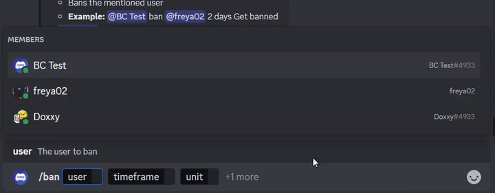
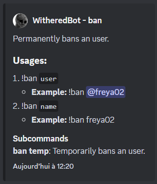

[bc-maven-central-shield]: https://img.shields.io/maven-central/v/io.github.freya022/BotCommands?label=Maven%20central&logo=apachemaven&versionPrefix=3
[bc-maven-central-link]: https://central.sonatype.com/artifact/io.github.freya022/BotCommands
[bc-jitpack-shield]: https://img.shields.io/badge/Snapshots-blue?logo=jitpack
[bc-jitpack-link]: https://jitpack.io/#freya022/BotCommands
[bc-releases]: #installation
[jda-version]: https://img.shields.io/badge/JDA-6.1.0+-important?logo=data:image/avif;base64,AAAAIGZ0eXBhdmlmAAAAAGF2aWZtaWYxbWlhZk1BMUIAAAGNbWV0YQAAAAAAAAAoaGRscgAAAAAAAAAAcGljdAAAAAAAAAAAAAAAAGxpYmF2aWYAAAAADnBpdG0AAAAAAAEAAAAsaWxvYwAAAABEAAACAAEAAAABAAADhgAAAH0AAgAAAAEAAAG1AAAB0QAAAEJpaW5mAAAAAAACAAAAGmluZmUCAAAAAAEAAGF2MDFDb2xvcgAAAAAaaW5mZQIAAAAAAgAAYXYwMUFscGhhAAAAABppcmVmAAAAAAAAAA5hdXhsAAIAAQABAAAAw2lwcnAAAACdaXBjbwAAABRpc3BlAAAAAAAAAEAAAAAvAAAAEHBpeGkAAAAAAwgICAAAAAxhdjFDgQAMAAAAABNjb2xybmNseAACAAIABoAAAAAOcGl4aQAAAAABCAAAAAxhdjFDgQAcAAAAADhhdXhDAAAAAHVybjptcGVnOm1wZWdCOmNpY3A6c3lzdGVtczphdXhpbGlhcnk6YWxwaGEAAAAAHmlwbWEAAAAAAAAAAgABBAECgwQAAgQBBYYHAAACVm1kYXQSAAoGGBV/u5VAMsQDGYBFcWjRfnvfQGK2RVRDm3mQHZYdniSAnTNueRTnA3322BUI8WYH8cbvaJOI7TYzDcxEhAtictt8XAknV+wzOYbYlbmBjrZ02hI+g5duvTHq4dfV1flM3q1qLS61XIEjnbRVOSSZ0AR0h5bgz3E4HaAMaRwHoEYHgGBkMUeWaz2KAGGLGgDvjrkadbwaS9gRwg1QvRm1s1XHO8shLVjZPy9Ec184Y8sYV1HKkMZMkU4t3sd0BMWj+8n00jkc1ncfPh+iVzu+W79Zq+HfFOgwRxWbyI8QWVP7ucZZMqrSaIIfN38e1giSADDizzWkDcIVWid2p4o4IOD+4vb3rwp9KuXIRT/xOW46I5OBN9pdoj1wPNcxU8nYooaa+WiFolKPUJmQomZLAuRrF1ghg3M9u+j3/MqAzXpPnJqxNLArxR7mTC3n/IgNbdlBJJpyFnmeDOhIIU5rQ0meBq4UwZoY6qjk/JDjkACRc/S8sT5Fp3ylStsDh24N8YuOjX7Blr41x4XZFuGOL/LJ9w5r1BvYKn4bxQ8zSekBnw5bHrhB3GidNP9ebWAIfvbRGftqMYjQtFrgWjeunLb88NjtaZU96bxBsNASAAoJGBV/u5IEBA0IMm5GYAAAEBCsBSQWO/F/+CLxcHCegywscOJVmyRW5DGFKOGjkgNf6igltcnWSK0aL8l8S3ThyMIgH8UZV/JWbWRztUFGUQjxZoVbuFffuH13zdQjN9V4E1lJ88XVLBQ3oMG4wfljykFslOwhdeD56Q==
[jda-releases]: https://github.com/discord-jda/JDA/releases
[discord-shield]: https://img.shields.io/discord/848502702731165738?logo=discord&logoColor=white&color=e0e3ff&label=Chat
[discord-invite]: https://discord.gg/frpCcQfvTz
[kdoc-shield]: https://img.shields.io/badge/KDoc-Docs-blue?logo=kotlin&labelColor=2b303b
[kdoc-link]: https://docs.bc.freya02.dev
[wiki-shield]: https://img.shields.io/badge/Wiki-Home-blue?logo=materialformkdocs&labelColor=2b303b
[wiki-link]: https://bc.freya02.dev/3.X


[![BotCommands version][bc-maven-central-shield]][bc-releases]
[![JDA version][jda-version]][jda-releases]
[![Snapshots][bc-jitpack-shield]][bc-jitpack-link]

[![Discord invite][discord-shield]][discord-invite]
[![Wiki home][wiki-shield]][wiki-link]
[![Documentation][kdoc-shield]][kdoc-link]

# BotCommands
A Kotlin-first (and Java) framework that makes creating Discord bots a piece of cake,
using the [JDA](https://github.com/discord-jda/JDA) library.

## Features
The framework being built around events and dependency injection,
your project can take advantage of that and avoid passing objects around, 
while also easily being able to use services provided by the framework. 

### Commands
* Automatic registration of commands, resolvers, services, etc... with full dependency injection
* Can be used with annotations or with code (in Kotlin)

### Application commands
* Slash commands with automatic & customizable argument processing
  * Supports choices, min/max values/length, channel types and autocomplete
  * Options can be grouped into objects
* Context menu commands (User / Message)
* Automatic, smart application commands registration

<details>
<summary>Example</summary>

```kt
@Command
class SlashBan : ApplicationCommand() {
    @JDASlashCommand(name = "ban", description = "Bans an user")
    suspend fun onSlashBan(
        event: GuildSlashEvent,
        @SlashOption(description = "The user to ban") user: User,
        @SlashOption(description = "Timeframe of messages to delete") timeframe: Long,
        // Use choices that come from the TimeUnit resolver
        @SlashOption(description = "Unit of the timeframe", usePredefinedChoices = true) unit: TimeUnit, // A resolver is used here
        @SlashOption(description = "Why the user gets banned") reason: String = "No reason supplied" // Optional
    ) {
        // ...
        event.reply_("${user.asMention} has been banned for '$reason'", ephemeral = true)
          .deleteDelayed(5.seconds)
          .await()
    }
}
```



</details>

### Text commands
* Supports prefix and mentions
* With two parsing modes:
  1. Each parameter is an argument, works the same as slash commands
  2. Manual argument consumption

<details>
<summary>Example</summary>

```kt
@Command
class TextBan : TextCommand() {
    @JDATextCommandVariation(path = ["ban"], description = "Bans the mentioned user")
    suspend fun onTextBan(
        event: BaseCommandEvent,
        @TextOption user: User,
        @TextOption(example = "2") timeframe: Long,
        @TextOption unit: TimeUnit, // A resolver is used here
        @TextOption(example = "Get banned") reason: String = "No reason supplied" // Optional
    ) {
        // ...
        event.reply("${user.asMention} has been banned")
            .deleteDelayed(5.seconds)
            .await()
    }
}
```

Can then be used as `@Bot ban @freya02 1 days A totally valid reason`

Here's how the help content would look with [a subcommand and a few more variations](src/test/kotlin/io/github/freya022/botcommands/test/readme/TextBan.kt):


</details>

### Components and modals
* Unlimited data storage for components, with persistent and ephemeral storage
* Both modals and persistent components have a way to pass data

### Event handlers
* Custom (annotated) event handlers, with priorities and async

### Localization
* Entirely localizable, from the command declaration to the bot responses

### Dependency injection
* Loads everything and passes objects automatically
* Can create custom conditions to disable services/commands at startup
* Can be replaced with Spring IoC

### Utilities
  * A PostgreSQL (and H2) database abstraction, with logged queries
  * An event waiter with (multiple) preconditions, timeouts and consumers for every completion state
  * Message parsers (tokenizers, see `RichTextParser`) and emoji resolvers (turning `:joy:` into 😂)
  * Paginators and menus of different types (using components!)

And way more features!

## Getting Started
You are strongly recommended to have some experience with Kotlin (or Java),
OOP, [JDA](https://github.com/discord-jda/JDA) and Dependency Injection basics before you start using this library.

### Prerequisites
* An [OpenJDK 17+](https://adoptium.net/temurin/releases/?version=21) installation
* For languages other than Kotlin, enable method parameters names, please refer to the [wiki page](https://bc.freya02.dev/3.X/using-botcommands/parameter-names/)

Head over to [the wiki](https://bc.freya02.dev/3.X/setup/getting-started/) to get started,
you can also check out the [examples](src/examples).

## Installation
[![BotCommands on maven central][bc-maven-central-shield] ][bc-maven-central-link]
### Maven
```xml
<dependencies>
  <dependency>
    <groupId>io.github.freya022</groupId>
    <artifactId>BotCommands</artifactId>
    <version>VERSION</version>
  </dependency>
</dependencies>
```

### Gradle
```gradle
repositories {
    mavenCentral()
}

dependencies {
    implementation("io.github.freya022:BotCommands:VERSION")
}
```

Alternatively, you can use Jitpack to use **snapshot** versions, 
you can refer to [the JDA wiki](https://jda.wiki/using-jda/using-new-features/) for more information.

## Modules
The base `BotCommands` artifact will include modules often used, while others are optional.

### Default modules
- [`BotCommands-core`](./BotCommands-core): Root module which contains most features

### Optional modules
- [`BotCommands-jda-ktx`](./BotCommands-jda-ktx): provides a set of Kotlin extensions and top-level functions, similar to [jda-ktx](https://github.com/MinnDevelopment/jda-ktx).
- [`BotCommands-spring`](./BotCommands-spring): Support for Spring Boot
- [`BotCommands-method-accessors-classfile`](./BotCommands-method-accessors): Improved alternative for this framework to call your functions

## Sample usage
Here is how you would create a slash command that sends a message in a specified channel.
<details>
<summary>Kotlin</summary>

```kt
@Command
@RequiresComponents // (Optional) Disables the command if components are not enabled
class SlashSay(
    private val buttons: Buttons // Factory for buttons
) : ApplicationCommand() {

    // The descriptions can also be moved to localization files, reducing noise
    @JDASlashCommand(name = "say", description = "Sends a message in a channel")
    suspend fun onSlashSay(
        event: GuildSlashEvent,
        @SlashOption(description = "Channel to send the message in") channel: TextChannel,
        @SlashOption(description = "What to say") content: String
    ) {
        val deleteButton = buttons.danger(UnicodeEmojis.WASTEBASKET).ephemeral {
            bindTo { buttonEvent ->
                buttonEvent.deferEdit().queue()
                buttonEvent.hook.deleteOriginal().await()
            }
        }

        event.reply_("Done!", ephemeral = true)
            .deleteDelayed(5.seconds)
            .queue()

        channel.sendMessage(content)
            .addActionRow(deleteButton)
            .await()
    }
}
```
</details>

<details>
<summary>Kotlin (DSL)</summary>

```kt
@Command
@RequiresComponents // (Optional) Disables the command if components are not enabled
class SlashSay(
    private val buttons: Buttons // Factory for buttons
) : GlobalApplicationCommandProvider {

    suspend fun onSlashSay(event: GuildSlashEvent, channel: TextChannel, content: String) {
        val deleteButton = buttons.danger(UnicodeEmojis.WASTEBASKET).ephemeral {
            bindTo { buttonEvent ->
                buttonEvent.deferEdit().queue()
                buttonEvent.hook.deleteOriginal().await()
            }
        }

        event.reply_("Done!", ephemeral = true)
            .deleteDelayed(5.seconds)
            .queue()

        channel.sendMessage(content)
            .addActionRow(deleteButton)
            .await()
    }

    // This is nice if you need to run your own code to declare commands.
    // For example, a loop to create commands based on an enum
    // If you don't need any dynamic stuff, just stick to annotations
    override fun declareGlobalApplicationCommands(manager: GlobalApplicationCommandManager) {
        manager.slashCommand("say", function = ::onSlashSay) {
            // The descriptions can also be moved to localization files
            description = "Sends a message in a channel"

            option("channel") {
                description = "Channel to send the message in"
            }

            option("content") {
                description = "What to say"
            }
        }
    }
}
```
</details>

<details>
<summary>Java</summary>

```java
@Command
@RequiresComponents // (Optional) Disables the command if components are not enabled
public class SlashSayJava extends ApplicationCommand {

    private final Buttons buttons; // Factory for buttons

    public SlashSay(Buttons buttons) {
        this.buttons = buttons;
    }

    // The descriptions can also be moved to localization files, reducing noise
    @JDASlashCommand(name = "say", description = "Sends a message in a channel")
    public void onSlashSay(
            GuildSlashEvent event,
            @SlashOption(description = "Channel to send the message in") TextChannel channel,
            @SlashOption(description = "What to say") String content
    ) {
        final Button deleteButton = buttons.danger(UnicodeEmojis.WASTEBASKET).ephemeral()
                .bindTo(buttonEvent -> {
                    buttonEvent.deferEdit().queue();
                    buttonEvent.getHook().deleteOriginal().queue();
                })
                .build();

        event.reply("Done!")
                .setEphemeral(true)
                .delay(Duration.ofSeconds(5))
                .flatMap(InteractionHook::deleteOriginal)
                .queue();

        channel.sendMessage(content)
                .addActionRow(deleteButton)
                .queue();
    }
}
```
</details>

## Live templates

IntelliJ IDEA users can use [live templates](https://www.jetbrains.com/help/idea/using-live-templates.html) provided in [this zip file](BotCommands%203.X%20Live%20Templates.zip),
helping you make commands and other handlers with predefined templates, for both Kotlin and Java, 
keeping a consistent naming scheme and acting as a cheatsheet.

For example, if you type `slashCommand` in your class, this will generate a slash command 
and guide you through the declaration.

A list of live template can be found in `Settings > Editor > Live Templates`,
in the `BotCommands 3.X - [Language]` group.

For an installation guide, you can follow [this guide from JetBrains](https://www.jetbrains.com/help/idea/sharing-live-templates.html#import).

## Support

Don't hesitate to join [the support server](https://discord.gg/frpCcQfvTz) if you have any question!

## Breaking changes

Due to the nature of JDA (and the Discord API), and to always improve the developer experience,
the library could introduce breaking changes to allow quick adoption of newer features and better practices.

While attempting to reduce breaking changes by using deprecation mechanisms,
it is not always possible or practical to use deprecations.

Small breaking/deprecating changes should be noticed via an increase of the **minor** version (`3.0.0` -> `3.1.0`),
while larger breaking changes should be seing an increase of the **major** version (`3.Y.Z` -> `4.0.0`).

## Contributing
If you want to contribute, make sure to base your branch on `3.X`, and create your PR from it.

It would be appreciated to focus on improving the documentation,
such as the [wiki](https://github.com/freya022/BotCommands-Wiki/), the library documentation, or by [creating examples](src/examples).<br>
Maintainers will focus on bug reports and feature requests, which you can create issues for. 

Read [the contributing guide](.github/CONTRIBUTING.md) for more details.
