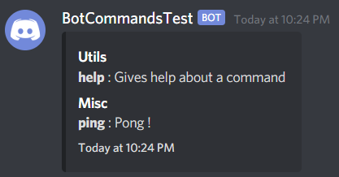
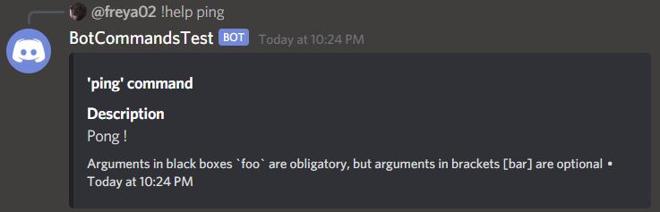

# PingBot

This is an example bot with a simple "ping" command, which responds with "Pong !" and then edits the ping in the message

### Preview - help content of all the commands

### Preview - help content of the 'ping' command
