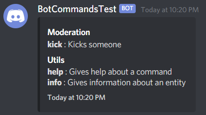
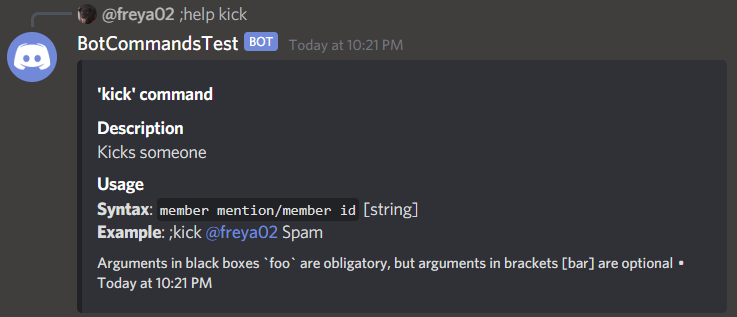
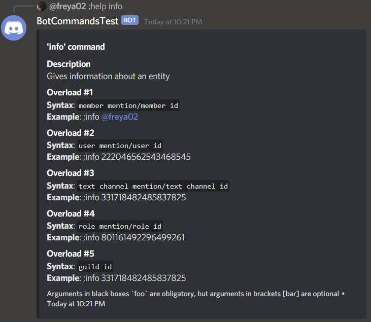

# Regex example

This is an example bot with a simple "kick" command, which accepts a Member and an optional reason as a String

Another command 'info' is also shown using methods with a specific order

### Preview - help content of all the commands

### Preview - help content of the 'kick' command

### Preview - help content of the 'info' command
